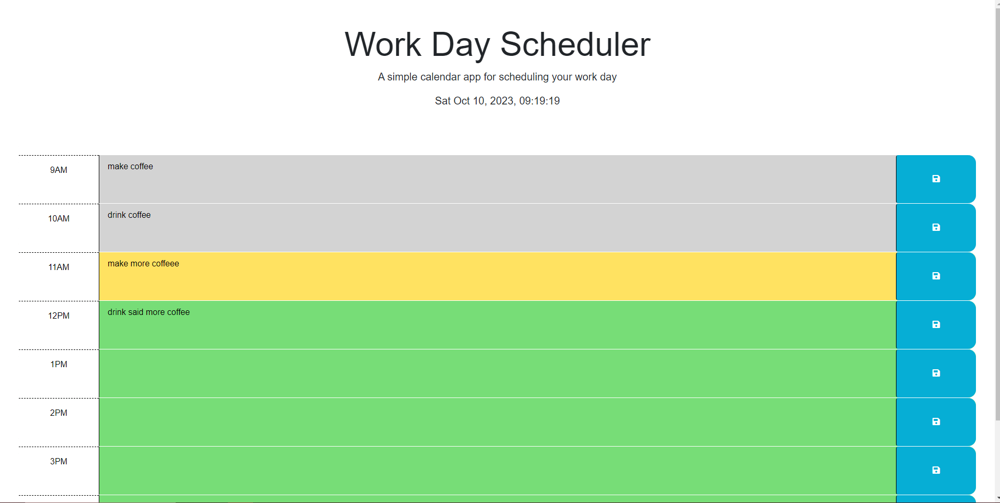

# Work Day Scheduler Starter Code

# Description
This program helps people who have busy a schedule to better organize and manage their time.
It color codes the day parts (each hour) by past, present, and future to help keep you on track. 
(I changed the present color to yellow)

## Credits
HTML and CSS code source: https://github.com/coding-boot-camp/crispy-octo-meme

## Links
Webpage: https://laude-noctis.github.io/radical-highway/
